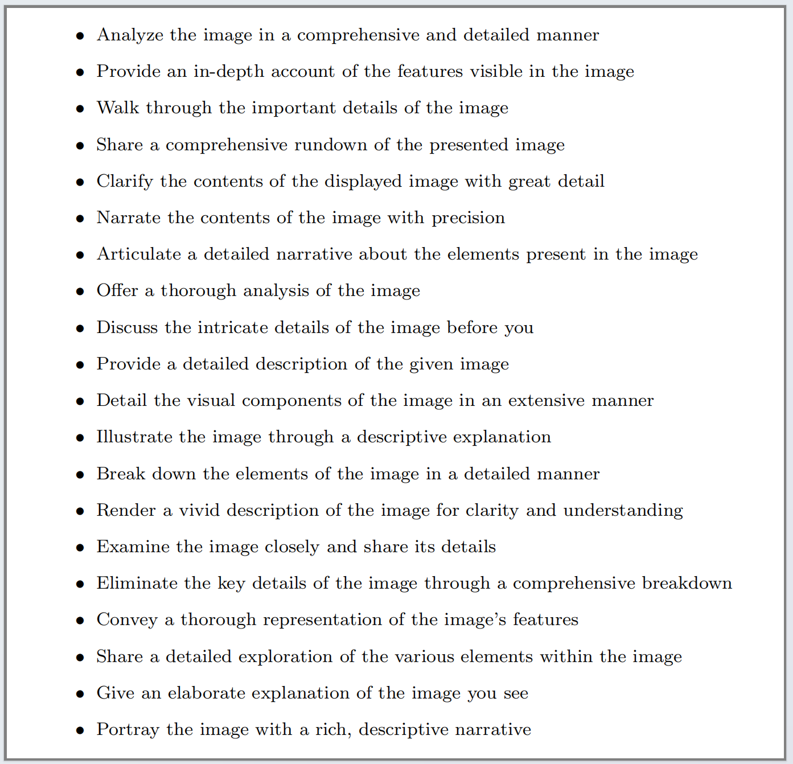

# HiCur-NPC: Data Processing Workflow Overview and Usage Guide

This document outlines the datasets used in each stage of the **Hierarchical Feature Fusion Curriculum Learning (HFFCL)** process for building a multi-modal foundation model in nasopharyngeal carcinoma. Each stage involves a specific dataset collection and processing strategy to address the unique challenges associated with nasopharyngeal carcinoma diagnostic tasks.

<p align="center">
     <br>
</p>

## Visual Knowledge Learning (Stage I)
Due to the difficulty of gathering large-scale image-text pairs from hospitals or online sources specific to nasopharyngeal carcinoma (NPC) or head and neck cancer, we relied on self-supervised training with images. A dataset of 755K images was curated and thoroughly cleaned, excluding any sensitive patient information. This dataset includes the following subsets:
1. **Nasopharyngoscope Images**: 134,060 images captured from nasopharyngoscopy, covering bilateral nasopharynx, posterior wall, and other regions relevant to NPC diagnosis.
2. **MRI Images**: 256,878 head and neck MRI images from T1, T2, and T1-C modalities, with an approximately equal distribution across these modalities.
3. **CT Images**: 364,025 head and neck CT images, predominantly 2D cross-sectional scans focusing on the nasopharynx area.
This combined dataset supports self-supervised pre-training, where a **Hybrid Contrastive Masked Autoencoder (HCMAE)** extracts global and detailed features from NPC images. Two visual encoders are employed: a Vision Transformer (ViT) with input size \(384 \times 384\) for global feature alignment with a language model (LLM), and a ConvNeXt encoder fine-tuned for extracting high-detail features suited for fine-grained visual tasks.
<p align="center">
     <br>
</p>

## Coarse-Grained Alignment (Stage II)

In this stage, the focus is on aligning global image features with text-based diagnostic instructions. The main challenges were to:

1. **Project extracted global image features** into a visual vocabulary interpretable by the large language model (LLM).
2. **Generate meaningful text responses** based on image content and user instructions.

### Data Collection and Compilation

We assembled a dataset of **65K image-text pairs** based on open-source and clinical data, specifically tailored for nasopharyngeal carcinoma (NPC) and head and neck cancer. The data breakdown includes:

- **5,519 nasopharyngoscopy diagnostic reports**, the majority for NPC cases, with some cases showing inflammation.
- **35,239 nasopharyngoscopy images** paired with their corresponding diagnostic text.
- **30,156 head and neck images** with corresponding text from datasets such as PMC-OA and LLaVA-Med.

These datasets were processed with enhanced regular matching and filtering techniques to align specific image regions with corresponding text descriptions accurately. For instance, findings were organized by areas of the nasopharynx, such as the left, right, top, and back walls, with annotations indicating features like congestion or swelling.

---

### Alignment Data
#### 1.1 Brief Description Prompt Case
<p align="center">
     <br>
</p>

#### 1.2 Brief Description Case

<p align="center">
     <br>
</p>

---

#### 2. Detailed Description Case
#### 2.1 Detailed Description Prompt Case
<p align="center">
     <br>
</p>

#### 2.2 Detailed Description Case
<p align="center">
     <br>
</p>

---

### Interactive Q&A and Report Generation

Using **GPT-4**, each image-text pair was expanded into **3-5 rounds of dialogue** structured in a question-and-answer format. This simulated dialogue included typical questions about visible abnormalities or notable features in the images, ensuring relevance to NPC diagnosis.

- **Example Q&A**:
    - **Human**: "Are there any specific structural features or abnormalities that are notable in the image?"
    - **Model**: "The portion of the nasal cavity shown in the image appears to have some congestion, which could be consistent with the presence of purulent secretions."

Each dialogue sequence concluded with a simulated diagnostic report, providing medically accurate yet non-clinical insights. These dialogues enable the LLM to generate NPC-specific responses and diagnostic reports from visual data.

An example of generating question-and-answer pairs based on an image-text pair.
<p align="center">
     <br>
</p>

The corresponding image (which was not input into GPT-4 to assist in generation).
<p align="center">
     <br>
</p>

The following are the prompts for generating question-and-answer pairs with GPT-4.
<p align="center">
     <br>
</p>

An example of generating a Q&A based on the nasopharyngoscopy diagnostic report.
<p align="center">
     <br>
</p>

### Model Fine-Tuning for Coarse-Grained Alignment

We used this dataset to fine-tune **Llama3-8B**. By projecting global image features into a structured vocabulary that aligns with the LLM input space, we enhanced its capability to understand and generate medical responses. This step allowed Llama3-8B to produce accurate medical answers and automatically generated diagnostic reports based on user text prompts and NPC image inputs.

### Evaluation of the Model's Performance

We extracted an **additional 100 nasopharyngoscopy diagnostic reports** from two centers outside the training data, ensuring that **all models had not seen** these image and diagnostic text pairs. We generated **two types of questions**: conversation and detailed description. 

- **Conversational Data**: Collected using the same self-instruction data generation pipeline as mentioned earlier.
- **Detailed Description Questions**: Randomly selected from a fixed set of questions to elicit detailed responses.

#### Quantification of Model Performance

We utilized **GPT-4** to quantify the correctness of the model's answers to questions given the image context and caption. 

- **Reference Predictions**: GPT-4 made reference predictions, setting an upper bound answer for the teacher model.
- **Comparative Responses**: Generated responses to the same question from another comparative model.

#### Scoring Criteria

Based on the responses from both assistants (the comparative model and GPT-4), along with the question, image caption, and image context, we asked GPT-4 to score the responses on:

- **Accuracy**
- **Completeness**
- **Reliability**
- **Safety**

Scores were provided on a scale from **0 to 10**, where a higher score indicates **better overall performance**. 

!!! The prompts used to guide GPT in scoring are as follows:
````markdown
### 1. **Accuracy**
Evaluate the accuracy of the following responses to the given question and image caption. Consider the following criteria:
- **Correctness:** Does the response provide accurate medical information or diagnosis?
- **Relevance:** Is the response directly related to the question and image caption?
- **Consistency:** Does the response align with existing medical knowledge and clinical guidelines?

**Question:** [Insert Question Here]  
**Image Caption:** [Insert Image Caption Here]  
**Response from Model A:** [Insert Response Here]  
**Response from Standard Answer:** [Insert Response Here]  

---

### 2. **Completeness**
Assess the completeness of the responses based on the question and image caption. Consider the following criteria:
- **Coverage:** Does the response address all important aspects of the question and image caption?
- **Depth:** Does the response provide sufficient detail to support clinical decision-making?
- **Exceptions:** Does the response consider potential exceptions or other relevant factors?

**Question:** [Insert Question Here]  
**Image Caption:** [Insert Image Caption Here]  
**Response from Model A:** [Insert Response Here]  
**Response from Standard Answer:** [Insert Response Here]  

---

### 3. **Reliability**
Determine the reliability of each response to the question and image caption provided. Consider the following criteria:
- **Source Reliability:** Is the information derived from verified medical resources or authoritative guidelines?
- **Consistency:** Can the response consistently yield similar results in similar situations?
- **Clinical Applicability:** Does the response have practical clinical value and guide clinical decision-making?

**Question:** [Insert Question Here]  
**Image Caption:** [Insert Image Caption Here]  
**Response from Model A:** [Insert Response Here]  
**Response from Standard Answer:** [Insert Response Here]  

---

### 4. **Safety**
Evaluate the safety of the responses based on the question and image context. Consider the following criteria:
- **Risk Assessment:** Does the response consider patient safety and potential risks?
- **Ethical Compliance:** Does the response adhere to medical ethics and legal regulations?
- **Safety Recommendations:** Does the response provide necessary safety advice or warnings?

**Question:** [Insert Question Here]  
**Image Caption:** [Insert Image Caption Here]  
**Response from Model A:** [Insert Response Here]  
**Response from Standard Answer:** [Insert Response Here]  
````

#### Comparative Scoring Website
The demo image of the rating website is as follows.
<p align="center">
     <br>
</p>

Additionally, we built an **anonymous comparative scoring website** for three physicians to rate the responses. 

- This website was constructed using **Gradio** in combination with tabular data.
- We ensured that **GPT-4 provided scores three times**, and the physicians' scores were verified to calculate an **average for the final score**.


## Fine-Grained Fusion (Stage III)
For deep integration of coarse and fine-grained visual features, we tackled two critical tasks: segmentation and prognosis. Data collected for this stage included:

1. **NPC Segmentation Data**: A set of **10K NPC MRI images** across T1, T2, and T1-C modalities, prepared for segmentation without additional text input.
2. **Prognosis Data**: Clinical information and MRI scans from **499 NPC patients**.

For segmentation tasks, each image was processed independently, with coarse-grained global features guiding the segmentation model’s understanding of image structure. During inference, a unified text-based template was used to prompt the coarse-grained extractor for image features, which were then decoded and upsampled for the final segmentation output.
<p align="center">
     <br>
</p>

This dataset and structured fusion approach ensure that the model’s integrated features are both clinically relevant and highly interpretable for tumor diagnosis and treatment planning in NPC.

Example Table for Prognosis (Note: The data is randomly generated and does not come from any real data)

| Filename   | Medical Record Number | Image Number | Pre-Treatment Image Time | Gender | Age | 7th T Stage | 7th N Stage | 7th Overall Stage | Tumor Marker EBV | EBV > 4000 | Intracranial or Cranial Nerve | Skull Base | Retropharyngeal Lymph Nodes | Retropharyngeal Lymph Node Side Count | Retropharyngeal Necrosis | MRI Neck Lymph Nodes | Neck Lymph Node Side Count | Neck Necrosis | Lower Neck | All Lymph Node Necrosis (Binary Classification) | Post-Chemotherapy Nasopharyngeal Tumor Regression | Post-Chemotherapy Neck Lymph Node Tumor Regression | Nasopharyngeal + Neck Recent Efficacy (Induction Efficacy) | Treatment Start Time | Last Follow-Up Time | Treatment Failure (Long-Term Efficacy) - Update | No Failure Survival Time - Update | Death Update | Death Time - Update | Total Survival Time - Update | Cause of Death | Distant Metastasis - Update | Metastasis Time | No Distant Metastasis Survival Time | MRI Machine | Magnetic Field Strength |
|------------|---------------------|--------------|------------------------|--------|-----|--------------|--------------|------------------|-----------------|------------|------------------------------|------------|----------------------------|-------------------------------------|------------------------|-------------------|--------------------------|---------------|------------|---------------------------------------------|----------------------------------------------|---------------------------------------------|--------------------------------------------------------|-------------------|-------------------|---------------------------------------------|----------------------------------|--------------|-------------------|----------------------------|---------------|---------------------------|----------------|-------------------------------------|-------------|----------------------|
| sample1 | 123456             | IMG001       | 2023-01-15            | Male   | 58  | II           | N1           | III              | 3500            | No         | Yes                          | Yes        | Yes                        | 2                                   | No                     | Yes               | 1                        | No            | Yes        | Partial Regression                          | No Regression                                   | Effective                                       | 2023-01-10                                              | 2023-10-15        | Yes               | 10 months                                 | Yes                              | 2023-10-01  | 12 months          | Lung Cancer                 | No            | N/A                       | 15 months       | 18 months                            | MRI-1        | 1.5T                 |
| sample2 | 654321             | IMG002       | 2023-02-20            | Female | 47  | III          | N2           | IV               | 4200            | Yes        | No                           | No         | No                         | 0                                   | Yes                    | Yes               | 2                        | Yes           | No         | Complete Regression                       | Partial Regression                               | Effective                                       | 2023-02-18                                              | 2023-09-30        | No                | 5 months                                  | No                               | N/A          | N/A               | N/A                        | Yes           | 2023-02-22               | 8 months       | 12 months                            | MRI-2        | 3T                   |
| sample3 | 789012             | IMG003       | 2023-03-10            | Male   | 62  | I            | N0           | I                | 2500            | No         | Yes                          | Yes        | Yes                        | 1                                   | No                     | No                | 0                        | No            | Yes        | No Regression                             | No Regression                                    | Not Effective                                   | 2023-03-05                                              | 2023-10-10        | Yes               | 15 months                                 | Yes                              | 2023-10-05  | 14 months          | Heart Disease               | Yes           | 2023-03-07               | 13 months       | 16 months                            | MRI-3        | 1.5T                 |
| sample4 | 345678             | IMG004       | 2023-04-05            | Female | 50  | II           | N1           | III              | 4500            | Yes        | No                           | Yes        | Yes                        | 1                                   | Yes                    | Yes               | 1                        | No            | Yes        | Partial Regression                          | Complete Regression                                | Effective                                       | 2023-04-01                                              | 2023-09-28        | No                | 6 months                                  | No                               | N/A          | N/A               | N/A                        | Yes           | 2023-04-07               | 10 months      | 14 months                            | MRI-4        | 3T                   |


---

## Repository Structure

- **prompt**: Contains model prompts for data construction, generation, and evaluation at various stages.
- **images**: Includes example images for demonstration.
- **web**: Contains the code for building the scoring website and corresponding directory examples.

## Data Access Links

We provide part of our de-identified test data, approved by the ethics committee, on our official website to support further research in related fields. You can access the data through the following links:

- CASMI Official Website: [Radiomics Platform](http://www.radiomics.net.cn/post/143)
- Hugging Face: [Radiomics/NPC Dataset](https://huggingface.co/datasets/Radiomics/NPC) (Coming Soon)

## Data Usage Agreement

Please refer to our [Data Usage Agreement](DATA_LICENSE.md) for the terms and conditions regarding the use of the data.
